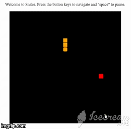

# SnakeGame
Browser version of the classic minigame "Snake". Will be done just using plain HTML, JavaScript, CSS. Goal is to get the apple without colliding with snake's body or edge of screen.

You can play the game at Codepen: https://codepen.io/IvanKok/pen/JQzwEW
You can also clone the repo and clicking on the HTML file. This should then launch on the browser.

Short gif of the game:

Please let me know if there are any issues, bugs, improvements, or questions about this! This has been a fun practice and I hope to make more games in the future.

**Steps in making the game:** 
* First, I need the basic visual components of the game, which initially is the screen and the player. At this point, everything is static, so I have two HTML divs, one for the screen and one for the player. For styling, I made the screen black, gave it a round number width and height (500px). For the player, I gave it an orange color and 20px for width and height.
* Next, I needed to be able to register user input, specifically the arrow keys. A quick Google search brought me to: https://stackoverflow.com/questions/12153357/how-to-register-document-onkeypress-event , which tells me the syntax for keydown event listener and I Googled the rest of the key codes for arrow keys as well as Space and Enter. I just consoled log something to test if they worked when pressed.
* I began to write a function like leftMovement() for when left arrow was pressed. I had to look up how to get and set the styling attributes of an HTML element in my JavaScript code so I can move the player left. I went on this site: https://zellwk.com/blog/css-values-in-js/ and found their getComputedStyle code working like a charm for getting css value of my player div. I Googled up “how to set css style in Javascript” and used this: https://www.w3schools.com/js/js_htmldom_css.asp. I created a left, right, up, and down movement, which is just getting the current position and adding an offset of square size (20px) in the corresponding direction.
* After I had the one step directional movement, I need to call the movement function multiple times. I found and used the setInterval Method to repeatedly call the movement functions at an interval: https://www.w3schools.com/jsref/met_win_setinterval.asp. The movements aren’t as smooth, because the delay also happens at first. I went on SO: https://stackoverflow.com/questions/6685396/execute-the-setinterval-function-without-delay-the-first-time which suggested I just call the function directly the first time. It was a great suggestion, but it can be abused in game, so I added smaller time delay with setTimeout function.
* At this point, I want to try my game out with a longer snake than just a small square. I added an increaseSize() function and bind it to Enter key for now. I saved the direction my snake was moving in with the key pressed and the length of my snake. The mistake I made here was just increasing the size of my snake by taking the length of my snake multiplied by size (width/height) of my square. It works only if the snake was moving in one direction. Here, I also segmented the snake by adding a black border to each square so I can visually see how long the snake is on screen.
* I realized my mistake when I tried to make my snake move in multiple directions, like right then left. There was no easy way for me to figure out the position of some middle segment of the snake because the snake can be very long with many previous user input that would affect the position of the snake.
* I had to redo a chunk of my code controlling the position of the body of my snake. I saved in git and deleted everything until I just have a working square (snake’s head) that can move. Then I realized that the snake’s body must follow the snake’s head, which is the mechanism for me to calculate the position of each segment of the snake.
* Working on my realization, I created a snakeArray to store the position of each segment of snake. Every time a movement function is called by the setInterval function, the snakeArray will also be updated. The tail will have the position of the segment in front of it and so on. Then I updated the head. I did it the other way around first (i.e. second segment gets the position of head and so on) but then the array will be overwritten.
* The next thing I did was to check if the snake collided with itself. I wrote a function didCollideWIthSelf() that returns a boolean, and it checks if the zeroth index of snake array, representing the head, is equal to any other index of the snake array. I check this in the movement functions after the body and head have been updated.
* After finishing the movement of my snake, I focused on the relatively easier part of generating the goal or apple. First I had to randomly generate the position of the apple. I used https://www.geeksforgeeks.org/javascript-math-random-function/ to help me generate my X and Y position. I divided my screen (500px) by 20, so the min is 0 and max is 25 (25 is non inclusive). Then I multiplied the random integers between 0 and 24 by 20 (size of apple). With my X and Y position, I add my apple to the document in the beginning of the game every time the snake “eats” the apple.
* I wrote my didCollideWithApple() function to find when the snake eats the apple. It similarly checks if snake array’s head is equal to the position of the apple. I call this function inside my movement functions.
* The last big thing is to remove the apple when the apple is eaten/collided. I found this resource: https://www.w3schools.com/jsref/met_node_removechild.asp to remove the apple HTML element by it’s parent, which is the screen element. I call removeApple, increaseSize, and generateApple in the movement function when didCollideWithApple returns true.
* Start the game with snake length of three and snake moving down. Refactored code to DRY principle and fixed up some bugs.

Bugs:
* Switching between two movements rapidly makes the snake goes faster
* Check apple spawn away from snake’s head

Possible Improvements:
* Audio cue for when the snake eats the apple, snake dying
* Styling for the screen
* Difficulty settings adjusting speed of the snake
* Score keeping
